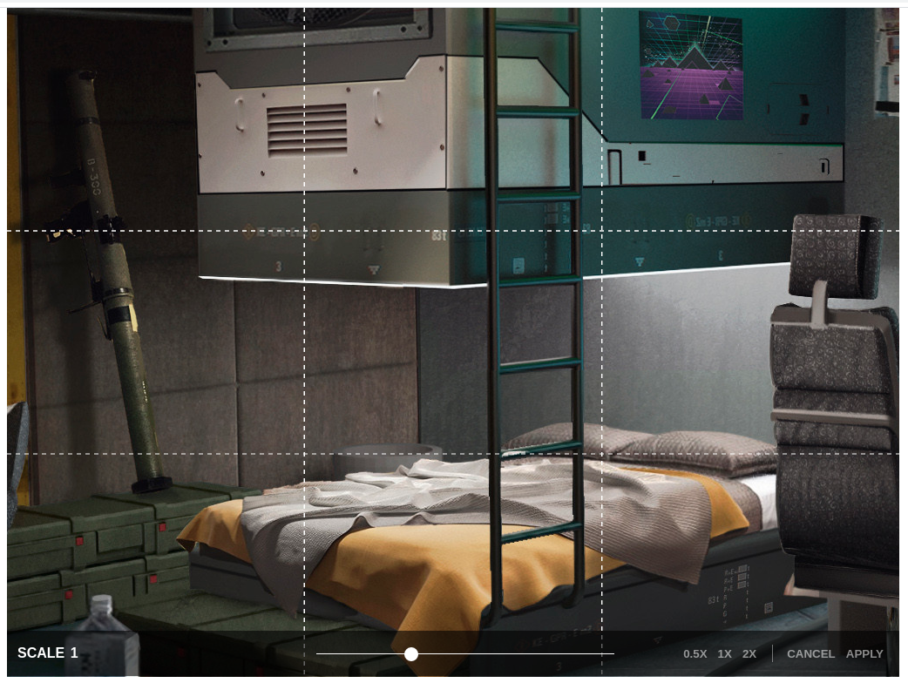

## Description
Simple HTML5 canvas based component used for scaling images.  Returns base64 encoded data of edited file.

## Props
* __width__ - int - Width in pixels of the canvas. (Defaults to width of container)
* __hegiht__ - int - Height in pixels of the. (Defaults to hieght of container)
* __maxScale__ - int - Maxium size the image can be scaled up to. (Defaults to 3)
* __scaleStep__ - float - How granular to scale the image (Defaults to 0.5)
* __src__ - string - URL/Base64 source for the image being scaled.
* __backgroundColor__ - string - Color of the canvas background visible when the image is scaled down. (Defaults to #FFFFFF)
* __onScaleApply__ - method - Method that is run once clicking the apply button, base64 encoded value of the canvas content returned as parameter
* __onCancel__ - method - Method that runs once the cancel button has been clicked.
* __displayResolution__ - bool - Show the scaled resolution in pixels at top right. (Defaults to true)
* __applyMessage__ - string - Label of the apply button in bottom right. (Defaults to Apply)
* __cancelMessage__ - string - Label of the cancel button in bottom right. (Defaults to Cancel)
* __drawGrid__ - bool - Whether or not to show gridlines over the image.
* __scaleSizes__ - bool - Shows predefined size buttons next to Cance/Apply buttons (Defaults 0.5,1.0,2.0)

## Examples

#### Grid
`<ReactImageScaler src={this.state.src} drawGrid={true}  width={1024} height={768}//>`

